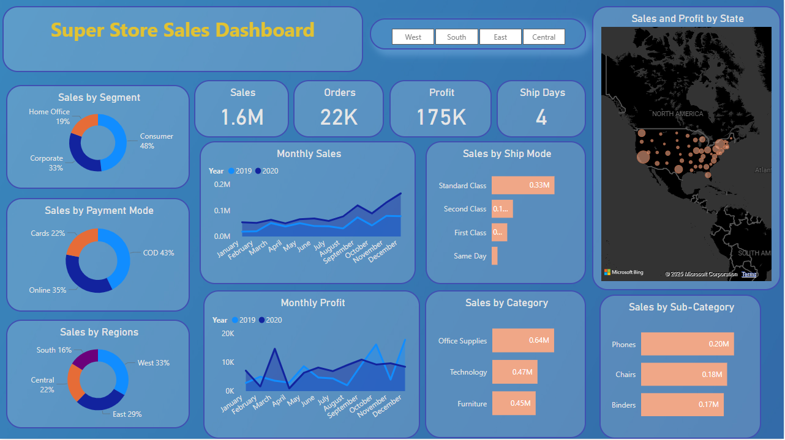
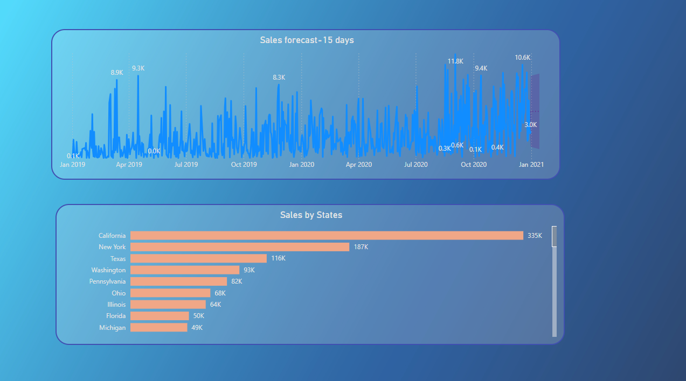

# Superstore-Sales-Forecasting-Dashboard-Using-Power-BI

## Objective

To contribute to the success of a business by utilizing data analysis techniques, specifically focusing on **time series analysis**, to provide valuable insights and accurate **sales forecasting**.

## Dataset

The project uses the **Superstore Sales Dataset**, which contains over **5,900 order records** capturing information such as:

- Order ID, Order Date, Ship Date  
- Customer Name, Segment, Region  
- Product Category and Sub-Category  
- Sales, Quantity, Discount, Profit  
- Shipping Mode and Payment Mode  

## Description

The project objective is broken into the following components:

1. **Dashboard Creation**  
   Identify key performance indicators (KPIs), build an intuitive and visually appealing dashboard, and add interactive visualizations and filters to support granular analysis.

2. **Data Analysis**  
   Provide valuable insights to business stakeholders regarding the effectiveness of sales strategies using visual tools and DAX logic.

3. **Sales Forecasting**  
   Apply time series models on historical sales data to forecast performance over the next 15 days.

4. **Actionable Insights and Recommendations**  
   Deliver practical insights to support growth, efficiency, and improved customer satisfaction for the supermarket.

## Tools & Technologies

- Power BI Desktop  
- Power Query Editor  
- DAX (Data Analysis Expressions)  
- Built-in Time Series Forecasting

## Project Deliverables

- Cleaned and transformed 5902-row dataset within Power BI  
- Custom DAX formulas for KPIs  
- Fully interactive dashboard  
- 15-day sales forecast  
- Regional and categorical breakdowns

## Key Insights

- Achieved **1.6M** in total sales across **22K orders**, yielding a profit of **175K** with an average shipping time of **4 days**.
- The **Consumer** segment dominated sales (48%), followed by **Corporate (33%)** and **Home Office (19%)**.
- **COD (43%)** is the most used payment mode, while **Online (35%)** and **Card (22%)** follow.
- The **West** region led with 33% of sales; **California** ranked highest among all states with **335K** in sales.
- **Office Supplies** and **Phones** are the top-performing category and sub-category respectively.
- Strong seasonal trends observed with sales and profit peaking in Q4 (Oct–Dec).

## Future Insights (15-Day Forecast)

- Forecasted daily sales are stable at **5304.19** from **Jan 1 to Jan 14, 2021**.
- Confidence intervals narrow over time, showing reduced uncertainty.
- Recommendation: Maintain consistent inventory, use lower bound (~1023) for buffer planning, and monitor trends to respond to market shifts.

## Dashboard Screenshots

### Main Dashboard

### Forecasting and State-wise Sales

## How to Use

1. Clone or download the repository  
2. Open the `.pbix` file in Power BI Desktop  
3. Explore the `Report View` for interactivity and forecasts  
4. Review the `Data` and `Model` views for DAX queries and data transformations

## Contact

For feedback or queries, contact:  
**Kousar Kousar**  
Email: kousar.kousar@bilkent.edu.tr
